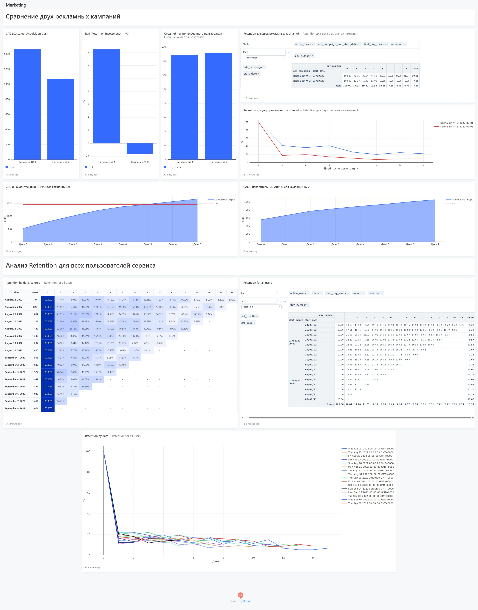

Данный дашборд посвящен:
* сравнению эффективности двух рекламных кампаний по показателям CAC (Customer Acquisition Cost), ROI (Return On Investement), средний чек и Retention
* Анализу Retention всех пользоваталей сервиса в разбиении на когорты по дате первой активности

Основные выводы, которые можно из него сделать:
Сравнение двух рекламных кампаний:
* У Кампании № 2 затраты на привлечение одного пользователя ниже, чем у Кампании № 1
* Несмотря на то, что CAC для кампании № 1 выше, она является более эффективной и выгодной с точки зрения ROI. Кампания № 2 же на момент анализа не окупилась.
* Сказать однозначно, отличаются ли группы по среднему чеку, без статистических тестов нельзя. Но видно, что даже если различия и есть, то несущественные. Причем средней чек даже немного выше во второй группе с отрицательным ROI, значит, дело в чем-то другом.
* Пользователи из обоих рекламных каналов практически не различаются по среднему чеку, но Retention почти в два раза выше у первой группы на протяжении всего периода с 1-го по 7-й день. Это и приводит к тому, что ROI у рекламной кампании №1 выше, то есть пользователи из РК №1 приносят нам больше денег.
* Для первой рекламной кампании накопительный ARPPU превысил затраты на привлечение одного покупателя (CAC) уже на 5-й день, тогда как для второй кампании даже на 7-й день значение CAC всё ещё превышало значение ARPPU. Это объясняет соответствующие значения ROI.
Анализ Retention для всех пользователей сервиса:
* Паттерн Retention для всех когорт по дате первой активности схож: на первый день после регистрации активными остаются от 15 до 20% пользователей соответствующей когорты. Далее эти значения также постепенно убывают.

