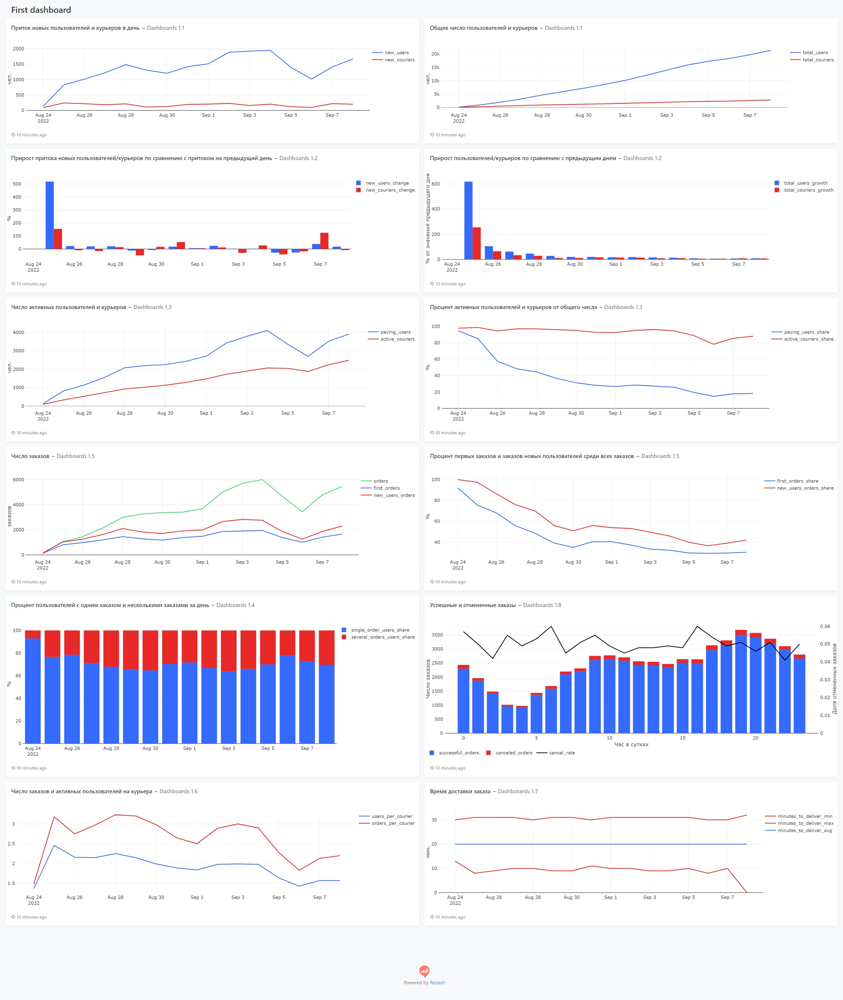

Данный дашборд посвящен анализу базовых числовых показателей, рассчитанных по пользователям, курьерам и заказам. 

Основные выводы, которые можно из него сделать:
* Число пользователей сервиса растет быстрее, чем число курьеров. В среднем в день к сервису присоединяется около 200 курьеров и 1500±500 пользователей. При этом ежедневный прирост колеблется вокруг этих значений и не проявляет заметного тренда к росту/уменьшению
* Относительные темпы роста общего числа пользователей и курьеров затухают, однако это обусловлено тем, что одно и то же число новых пользователей/курьеров с каждым днем будет составлять все меньший процент от общего числа. 
* Число активных пользователей растет, что логично, так как общее число пользователей увеличивается. При этом доля активных пользователей со временем уменьшается, и к 8 сентября выходит на уровень 18%; доля активных курьеров более стабильна и большую часть времени держится на уровне около 90%.
* Также видно, что доля активных пользователей сильнее коррелирует с числом новых пользователей, чем с их общим числом.
* 6 сентября была просадка числа новых пользователей, что, вероятно, и повело за собой просадки многих других показателей, таких как число заказов, доля активных пользователей и т.д.
* Показатель new_users_orders выше, чем first_orders. Это означает, что есть довольно много пользователей, которые в первый день делают больше одного заказа
* Доли первых заказов (first_orders_share) и заказов новых пользователей (new_users_orders_share) после 30 августа выходят на плато на уровни примерно 35% и 50% соответственно. То есть каждый день примерно 35% от всех заказов это первые заказы новых пользователей и 50% заказов сделаны пользователями, которые зарегистрировались в этот день
В первый день new_users_orders_share 100%, что неудивительно, так как это первый день работы сервиса и все пользователи новые 
* В первый день доля пользоваталей сделавших несколько заказов, крайне низкая, возможно из-за того, что только установили приложение. Однако в последующие дни доля пользователей с несколькими заказами держится в среднем на уровне 29.8%
* Больше всего заказов приходится на вечер с 17 часов до 22. Меньше всего ночью - 1 часа до 8. При этов с увеличением числа заказов вечером показатель cancel_rate не растет, что хорошо
* Среднее время доставки заказа держится на уровне 20 минут и всегда не меньше 10 минут и не больше 30
* Каждый курьер в день в среднем доставляет от 2 до 3 заказов. Так как среднее время доставки заказа 20 минут, можно сделать вывод, что нагрузка на курьеров низкая, и пока можно приостановить наращивание их числа, чтобы довести число заказов на курьера до более высокого значения

